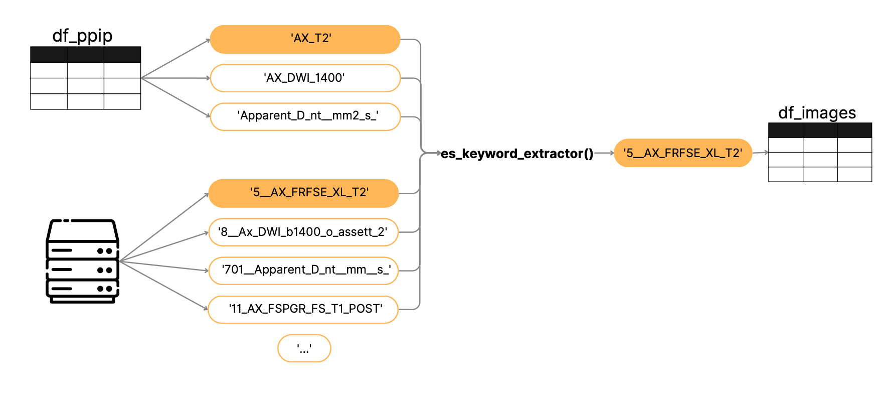

# Scalable Medical Data Curation and Labelling

This repository provides a **demonstrator** for an end-to-end curation and labelling pipeline of medical image datasets **at scale**—demonstrated here for prostate cancer detection on biparametric MRI from internal data sources at **Brigham and Women's Hospital, Boston**. The goal is to facilitate the curation of labeled datasets, making them more accessible and accelerating the development and **clinical adoption** of **NeuralNet-based algorithms**.

## Repo Overview

The pipeline leverages automated extraction, retrieval, and matching of clinical entities from thousands of radiology and pathology reports, as well as biopsy coordinates, to generate **weak labels (bounding boxes)** for training deep learning models. **Key features include:** automated entity extraction from unstructured clinical text using LLMs and NLP, cross-source data matching and programmatic label generation, tools for dataset export and downstream model experimentation.

### Installation

This project uses [uv](https://github.com/astral-sh/uv) for Python package management.

```sh
# Install uv (if not already installed)
pip install uv

# Create virtual environment and install dependencies
uv venv
source .venv/bin/activate
uv pip install -r requirements.txt
```

### Repository Structure

- `main.py` — Pipeline entry point
- `preprocessing.py` — Clinical text preprocessing and parsing
- `extraction.py` — LLM-based entity extraction from reports  
- `matching.py` — Cross-source entity matching logic
- `postprocessing.py` — Label generation and validation
- `export.py` — Dataset export utilities
- `llm.py` — Language model interaction utilities
- `configs.yaml` — Pipeline configuration parameters
- `cv_model_experiments/` — Example downstream model training scripts
- `synthetic_output_dfs/` — Synthetic demonstration data
- `media/` — Figures and thesis PDF for documentation

### Demonstration Data

Since raw clinical reports are rarely available in public datasets, this repository includes **synthetic demonstration data** in `synthetic_output_dfs/` that shows the expected pipeline outputs for the original prostate cancer detection use case (see below):

- `clinical_metadata_10_synthetic_samples.csv` - Sample patient metadata with extracted clinical entities 
- `image_acquisition_10_synthetic_samples.csv` - Sample imaging parameters and scanner information

**Note**: These are completely synthetic examples created for demonstration purposes only.

## Motivation

**Labeled medical imaging data is scarce, and expert annotation is not scalable.** At the time of developing this work, the lack of large-scale labeled datasets is a major bottleneck preventing neural networks from becoming clinically relevant in diagnostic tasks. Traditional approaches rely on costly human experts to manually annotate medical images, which is:

- **Prohibitively expensive & time-consuming** at the scale needed for deep learning
- **Subjective & limited by ground truth** with at times substantial inter-observer variability and lack of histopathological confirmation (e.g. in prostate cancer detection case)

**Our solution**: Build an automated system that can create labeled datasets with **no human supervision** by intelligently mining the vast amounts of unstructured clinical data already available in hospital systems.

## LLM Experimentation in Clinical Entity Extraction

A core innovation of this pipeline is the **dual-approach LLM strategy** for extracting clinical entities from unstructured medical text. We experimented with two complementary methods to maximize extraction accuracy while maintaining interpretability:

### 1. Natural Language Inference (NLI) Approach
**Model**: `facebook/bart-large-mnli`  
**Method**: Zero-shot classification using entailment relationships  
**Applications**: PI-RADS score extraction, lesion size detection, anatomical region classification

The NLI approach treats entity extraction as a natural language inference task, where clinical text serves as "premises" and target entities as "hypotheses." This method excels at structured classification tasks where the target entities are well-defined categories.

**Technical Specifications**:
- **Model Size**: 406 million parameters (4x larger than BERT-base)
- **Training**: Multi-Genre Natural Language Inference (MultiNLI) corpus
- **Specialization**: Zero-shot text classification (0SHOT-TC)
- **Threshold**: 0.5 entailment probability for optimal precision/recall balance


### 2. Embedding Similarity Approach  
**Model**: `emilyalsentzer/Bio_ClinicalBERT`  
**Method**: Semantic similarity matching using clinical domain embeddings  
**Applications**: Series description matching, anatomical region linking, cross-source entity alignment

The embedding approach leverages domain-specific clinical language models to compute semantic similarities between text descriptions and target entities. This method is particularly effective for matching variable text descriptions to standardized anatomical or imaging terms.

**Technical Specifications**:
- **Model Size**: 109 million parameters (4x smaller than BART-large)
- **Training**: Twice fine-tuned on medical datasets including MIMIC-III v1.4
- **Domain**: Clinical text specialization
- **Threshold**: 0.7 cosine similarity for optimal performance


### LLM Extraction Benchmarking

**Performance Metrics** (based on 699 total predictions across all tasks):

| Method | Task | Accuracy | Error Rate | Runtime | Data Loss |
|--------|------|----------|------------|---------|-----------|
| **ES** | Image series extraction | 97.0% | 8/267 | 42min* | 0% |
| **ES** | Pathology diagnosis matching | 92.6% | 8/108 | 28min* | 89.8% |
| **NLI** | Radiology diagnosis matching | 95.4% | 5/108 | 28min* | 0% |
| **NLI** | PI-RADS score extraction | 100.0% | 0/108 | 56min* | 0% |
| **NLI** | Lesion size extraction | 89.8% | 11/108 | 56min* | 0% |

*Combined runtime for pathology and radiology matching tasks on Mac M1 Pro with 10-core CPU and 14-core GPU (total curation time is about 2h19min)

**Key Findings**:
- **NLI approach** achieved higher precision for structured entities (PI-RADS scores, lesion measurements)
- **Embedding approach** showed superior recall for variable text descriptions (series descriptions, anatomical regions)
- **Combined approach** achieved optimal performance across all entity types
- **Text augmentation techniques** (abbreviation expansion, anatomical standardization) improved performance by 15-25%

### Failure Case Analysis

Our comprehensive error analysis identified **51 total error cases** across all LLM tasks, categorized into three main failure types:

#### Category 1: Model Errors (23.5% of errors)
**FC1: Similar Semantics (19.6%)** - Limited semantic differentiation between candidates, especially for short text sequences (30-50 characters) in series descriptions and anatomical regions.

**FC2: Model Hallucinations (3.9%)** - Models extracting values not present in original text (e.g., extracting "87" as lesion size from prostate volume mention).

#### Category 2: Documentation Inconsistencies (50.9% of errors)
**FC3: Non-meaningful Series Descriptions (3.9%)** - Inconsistent terminology across imaging studies making classification impossible.

**FC4: Faulty Manual Data Input (15.7%)** - Human errors in clinical documentation including spelling mistakes and incorrect abbreviations.

**FC7: Incomplete Radiology Sections (31.4%)** - Missing diagnostic information in impression sections due to clinical workflow practices.

#### Category 3: Vague Terminology & Inter-reader Disagreement (25.5% of errors)
**FC5: Ambiguous Lesion Characterization (19.6%)** - Significant variation in anatomical region descriptions between radiologists.

**FC6: Inter-reader Disagreement (5.9%)** - Discrepancies between pre-procedural and interventional radiologist assessments.

### Clinical Entity Extraction Examples

The pipeline extracts various clinical entities from radiology and pathology reports:




### Data Reduction and Quality Metrics

The LLM-based extraction process significantly reduces manual annotation requirements while maintaining high quality:

| Data Modality                | Start Size | Final Size | Total Data Loss (%) |
|------------------------------|------------|------------|---------------------|
| Image series                 | 31,671     | 258        | 99.19%              |
| Radiology diagnosis sections | 11,399     | 99         | 99.13%              |
| Radiology reports            | 10,788     | 86         | 99.20%              |
| Pathology diagnosis sections | 7,844      | 105        | 98.66%              |
| Pathology reports            | 3,286      | 86         | 97.38%              |
| Image studies                | 1,916      | 86         | 95.51%              |
| Biopsy cases                 | 875        | 86         | 90.17%              |
| Biopsy targets               | 591        | 105        | 82.23%              |
| Patients                     | 579        | 84         | 85.49%              |

**Staggering Data Reduction Reveals Clinical Documentation Challenges**

The massive data reduction across all modalities (>80% loss in every category) highlights the significant noise and poor documentation quality in real-world clinical data. This reduction stems from several critical issues:

- **Inconsistent Series Descriptions**: Manual data input leads to highly variable, non-standardized imaging series names that are difficult to parse and analyze
- **Poor Documentation Practices**: Clinical workflows prioritize patient care over downstream analysis needs
- **Human Error**: Manual data entry introduces spelling mistakes, abbreviations, and inconsistent terminology


*Example of the extreme variability in series descriptions across different imaging studies, demonstrating how manual data input creates parsing challenges for automated systems (look at 44% of "other" Series descriptions).*

### Text Augmentation Techniques

To address semantic similarity challenges, we implemented specialized preprocessing:

**Series Description Augmentation**:
- `"t2"` → `"t two produced by using longer TE and TR times"`
- `"dwi"` → `"diffusion coefficient weighted imaging"`
- `"1400"` → `"one thousand four hundred"`

**Anatomical Region Standardization**:
- `"POSTEROMEDIAL"` → `"POSTERIOR MEDIAL"`
- `"ANTEROLATERAL"` → `"ANTERIOR LATERAL"`

These augmentation techniques improved matching accuracy by 15-25% for challenging short text sequences.

### Why This Approach?

**Converting Clinical NER to Text Classification**: Rather than traditional named entity recognition (which requires extensive training data), we simplified the task to zero-shot text classification. This approach leverages the fact that we know what entities we're looking for, eliminating the need for complex NER models.

**Out-of-the-Box Performance**: Both models work without fine-tuning, making them practical for immediate deployment in clinical data curation workflows.

**Interpretability vs. Performance Trade-off**: The BERT-based approach provides better interpretability through cosine similarity scores, while the BART-based approach offers superior performance through sophisticated neural classification.

## Original Use Case: Prostate Cancer Detection and Grading on Biparametric MRI

Instead of relying on **costly human-experts to annotate tumors** on images (often with no ground truth in terms of histopathologically-confirmed tumors) we constructed bounding boxes as "weak labels" by mining **>12k Radiology reports**, **>4k Pathology reports** and **>600 Biopsy Target coordinates**. We created a large, labeled dataset, suitable for training deep learning models without manual expert annotation.

### Data Curation Overview
The overall process involves several stages, from raw data ingestion to the final generation of labeled image datasets. The following diagram provides a high-level overview of the pipeline.


### The Pipeline in Detail

#### 1) Data Input
The pipeline starts with **four** primary sources of clinical data:
-   **Radiology Reports (>12,000):** Unstructured text reports from MRI scans, describing findings.
-   **Pathology Reports (>4,000):** Reports detailing histopathological findings from biopsy samples.
-   **Biopsy Target Coordinates (>600):** Semi-structured data indicating the precise location of biopsies.
-   **Imaging studies (>1,900):** Imaging studies containing >30k image files with significantly varying Series descriptions


#### 2) Automated Curation Process
The core of the project is the automated curation process, which includes:
-   **LLM-based Entity Extraction:** We use LLMs pre-trained on clinical text, from HF's Transformer library to extract key clinical entities from Radiology and Pathology reports (e.g., PI-RADS scores, tumor locations, Gleason scores).
-   **Retrieval and Matching:** The extracted entities are then used to retrieve and match data across the different sources. For example, a patient's radiology report is matched with their pathology results and biopsy coordinates.
-   **Label Generation:** Finally, the matched and verified data is used to export bounding boxes as segmentations in DICOM or nifti, as well as the three imaging modalities usually used for prostate cancer diagnosis (T2, DWI, ADC).


#### 3) Pipeline Output
The output of the pipeline is a curated dataset of biparametric MRI scans with bounding box annotations for prostate cancer lesions. The bounding boxes are approximations of expert-derived tumor segmentations and use the coordinate of the MR guided biopsy as reference point and the lesion measurements described in the radiology reports as radius.

Here are some examples of the generated labels:


This automated approach allowed for the creation of large-scale datasets that would be prohibitively expensive and time-consuming to create manually. The goal was to use these "weak" labels to increase dataset sizes for training and fine-tuning of computer vision models for automated cancer detection.

### Exporting and Label Generation

The pipeline exports structured data in multiple formats for downstream model training:


**Export Formats**:
- **DICOM**: Standard medical imaging format with embedded annotations
- **NIfTI**: Neuroimaging format for deep learning frameworks
- **CSV**: Structured metadata for analysis and validation

## Important Limitations & Why This Work Might Still Matter

- **Dataset specificity & limited generalizability**: This pipeline was designed for **internal data at Brigham and Women's Hospital**, with specific formatting and may not generalize directly to public datasets.
- **Lack of public benchmarks**: Requires raw clinical reports for benchmarking and testing (currently almost non-existent in public datasets) 
- **The field has evolved**: Joint multi-modal embedding approaches, representation learning, and foundation models now often outperform explicit entity extraction and label construction methods

Despite these limitations, this repository provides value as:

- **Interpretable approach**: Explicit entity extraction may be more interpretable for humans than pure embedding approaches
- **Resource-constrained settings**: Where massive multimodal medical datasets are scarce, simple data curation pipelines like this can help address the cold-start problem
- **Systematic methodology & baseline**: Provides a structured approach to clinical text mining and cross-source data matching that serves as a useful comparison point

## Future Directions

- **Prospective medical data curation**: The most promising path may be integrating AI development into clinical workflows from the outset—deploying lightweight curation pipelines like this during data generation to ensure patient care contributes systematically to improving treatment through continuous AI training
- **Joint embedding approaches**: Move toward text-image joint representation learning
- **Cross-institutional validation**: Test generalizability across different healthcare systems

## Acknowledgements & Contributing

This work was developed at Brigham and Women's Hospital as part of research into automated medical dataset curation. While the specific implementation may not generalize to all settings, we hope the systematic approach to clinical text mining and entity extraction provides a useful baseline for the research community. Contributions are always welcome!

---

*This automated approach represents one systematic method for clinical data curation, addressing the critical need for labeled medical imaging data that existed at the time of development.*